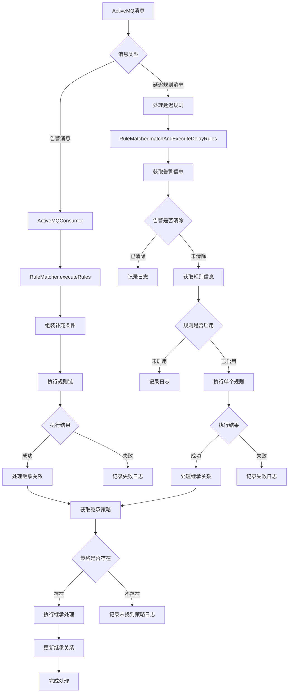

# 系统流程图

## 流程说明

1. **消息接收**
    - 系统通过ActiveMQ接收两类消息：告警消息和延迟规则消息
    - 告警消息进入常规处理流程
    - 延迟规则消息进入延迟规则处理流程

2. **规则匹配和执行**
    - 常规处理流程：组装补充条件后执行规则链
    - 延迟规则处理：检查告警状态和规则状态后执行单个规则

3. **继承处理**
    - 规则执行成功后进入继承处理流程
    - 根据规则配置获取对应的继承策略
    - 执行继承处理并更新关系

4. **异常处理**
    - 各个环节都有完善的日志记录
    - 对执行失败的情况进行记录
    - 对未找到继承策略的情况进行记录